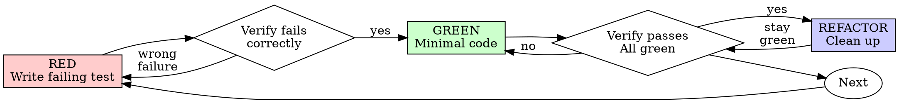

# Test-Driven Development (TDD)

## Overview

Write the test first. Watch it fail. Write minimal code to pass.

**Core principle:** If you didn't watch the test fail, you don't know if it tests the right thing.

**Violating the letter of the rules is violating the spirit of the rules.**

## Token Efficiency

**Follow `references/token-efficiency.md` rules.** When finding test files or understanding code to test, use Grep and targeted reads instead of reading entire source files.

## When to Use

**Always:**

- New features
- Bug fixes
- Refactoring
- Behavior changes

**Exceptions (ask your human partner):**

- Throwaway prototypes
- Generated code
- Configuration files

Thinking "skip TDD just this once"? Stop. That's rationalization.

## The Iron Law

```
NO PRODUCTION CODE WITHOUT A FAILING TEST FIRST
```

Write code before the test? Delete it. Start over.

**No exceptions:**

- Don't keep it as "reference"
- Don't "adapt" it while writing tests
- Don't look at it
- Delete means delete

Implement fresh from tests. Period.

## Red-Green-Refactor



### RED - Write Failing Test

Write one minimal test showing what should happen.

<Good>
```gleam
import gleeunit/should
import myapp/retry

pub fn retries_failed_operations_3_times_test() {
let operation = fn(state) {
let attempts = state + 1
case attempts < 3 {
True -> Error(#(attempts, "fail"))
False -> Ok(#(attempts, "success"))
}
}

retry.retry_operation(operation, 0)
|> should.be_ok
|> should.equal(#(3, "success"))
}

````
Clear name, tests real behavior, one thing
</Good>

<Bad>
```gleam
pub fn retry_works_test() {
  // Vague name
  retry.retry_operation(some_mock_fn, 0)
  |> should.be_ok
}
````

Vague name, doesn't show what behavior is tested
</Bad>

**Requirements:**

- One behavior
- Clear name
- Real code (no mocks unless unavoidable)

### Verify RED - Watch It Fail

**MANDATORY. Never skip.**

```bash
gleam test
```

Confirm:

- Test fails (not errors)
- Failure message is expected
- Fails because feature missing (not typos)

**Test passes?** You're testing existing behavior. Fix test.

**Test errors?** Fix error, re-run until it fails correctly.

### GREEN - Minimal Code

Write simplest code to pass the test.

<Good>
```gleam
pub fn retry_operation(
  operation: fn(a) -> Result(#(a, b), #(a, String)),
  initial_state: a,
) -> Result(#(a, b), #(a, String)) {
  do_retry(operation, initial_state, 0)
}

fn do*retry(
operation: fn(a) -> Result(#(a, b), #(a, String)),
state: a,
attempt: Int,
) -> Result(#(a, b), #(a, String)) {
case operation(state) {
Ok(result) -> Ok(result)
Error(#(new_state,*)) if attempt < 2 ->
do_retry(operation, new_state, attempt + 1)
Error(e) -> Error(e)
}
}

````
Just enough to pass
</Good>

<Bad>
```gleam
pub fn retry_operation(
  operation: fn(a) -> Result(#(a, b), #(a, String)),
  initial_state: a,
  options: RetryOptions,  // YAGNI
) -> Result(#(a, b), #(a, String)) {
  // Configurable max retries, backoff strategies, callbacks...
  // Over-engineered
}
````

Over-engineered
</Bad>

Don't add features, refactor other code, or "improve" beyond the test.

### Verify GREEN - Watch It Pass

**MANDATORY.**

```bash
gleam test
```

Confirm:

- Test passes
- Other tests still pass
- Output pristine (no errors, warnings)

**Test fails?** Fix code, not test.

**Other tests fail?** Fix now.

### REFACTOR - Clean Up

After green only:

- Remove duplication
- Improve names
- Extract helpers

Keep tests green. Don't add behavior.

### Repeat

Next failing test for next feature.

## Good Tests

| Quality          | Good                                | Bad                                                  |
| ---------------- | ----------------------------------- | ---------------------------------------------------- |
| **Minimal**      | One thing. "and" in name? Split it. | `pub fn validates_email_and_domain_and_whitespace()` |
| **Clear**        | Name describes behavior             | `pub fn test1_test()`                                |
| **Shows intent** | Demonstrates desired API            | Obscures what code should do                         |

## Why Order Matters

**"I'll write tests after to verify it works"**

Tests written after code pass immediately. Passing immediately proves nothing:

- Might test wrong thing
- Might test implementation, not behavior
- Might miss edge cases you forgot
- You never saw it catch the bug

Test-first forces you to see the test fail, proving it actually tests something.

**"I already manually tested all the edge cases"**

Manual testing is ad-hoc. You think you tested everything but:

- No record of what you tested
- Can't re-run when code changes
- Easy to forget cases under pressure
- "It worked when I tried it" ≠ comprehensive

Automated tests are systematic. They run the same way every time.

**"Deleting X hours of work is wasteful"**

Sunk cost fallacy. The time is already gone. Your choice now:

- Delete and rewrite with TDD (X more hours, high confidence)
- Keep it and add tests after (30 min, low confidence, likely bugs)

The "waste" is keeping code you can't trust. Working code without real tests is technical debt.

**"TDD is dogmatic, being pragmatic means adapting"**

TDD IS pragmatic:

- Finds bugs before commit (faster than debugging after)
- Prevents regressions (tests catch breaks immediately)
- Documents behavior (tests show how to use code)
- Enables refactoring (change freely, tests catch breaks)

"Pragmatic" shortcuts = debugging in production = slower.

**"Tests after achieve the same goals - it's spirit not ritual"**

No. Tests-after answer "What does this do?" Tests-first answer "What should this do?"

Tests-after are biased by your implementation. You test what you built, not what's required. You verify remembered edge cases, not discovered ones.

Tests-first force edge case discovery before implementing. Tests-after verify you remembered everything (you didn't).

30 minutes of tests after ≠ TDD. You get coverage, lose proof tests work.

## Common Rationalizations

| Excuse                                 | Reality                                                                 |
| -------------------------------------- | ----------------------------------------------------------------------- |
| "Too simple to test"                   | Simple code breaks. Test takes 30 seconds.                              |
| "I'll test after"                      | Tests passing immediately prove nothing.                                |
| "Tests after achieve same goals"       | Tests-after = "what does this do?" Tests-first = "what should this do?" |
| "Already manually tested"              | Ad-hoc ≠ systematic. No record, can't re-run.                           |
| "Deleting X hours is wasteful"         | Sunk cost fallacy. Keeping unverified code is technical debt.           |
| "Keep as reference, write tests first" | You'll adapt it. That's testing after. Delete means delete.             |
| "Need to explore first"                | Fine. Throw away exploration, start with TDD.                           |
| "Test hard = design unclear"           | Listen to test. Hard to test = hard to use.                             |
| "TDD will slow me down"                | TDD faster than debugging. Pragmatic = test-first.                      |
| "Manual test faster"                   | Manual doesn't prove edge cases. You'll re-test every change.           |
| "Existing code has no tests"           | You're improving it. Add tests for existing code.                       |

## Red Flags - STOP and Start Over

- Code before test
- Test after implementation
- Test passes immediately
- Can't explain why test failed
- Tests added "later"
- Rationalizing "just this once"
- "I already manually tested it"
- "Tests after achieve the same purpose"
- "It's about spirit not ritual"
- "Keep as reference" or "adapt existing code"
- "Already spent X hours, deleting is wasteful"
- "TDD is dogmatic, I'm being pragmatic"
- "This is different because..."

**All of these mean: Delete code. Start over with TDD.**

## Example: Bug Fix

**Bug:** Empty email accepted

**RED**

```gleam
import gleeunit/should
import myapp/form

pub fn rejects_empty_email_test() {
  form.submit_form(FormData(email: ""))
  |> should.be_error
}
```

**Verify RED**

```bash
$ gleam test
FAIL: Expected Error, got Ok(...)
```

**GREEN**

```gleam
pub type FormData {
  FormData(email: String)
}

pub fn submit_form(data: FormData) -> Result(Nil, String) {
  case string.trim(data.email) {
    "" -> Error("Email required")
    _ -> Ok(Nil)
  }
}
```

**Verify GREEN**

```bash
$ gleam test
PASS
```

**REFACTOR**
Extract validation for multiple fields if needed.

## Verification Checklist

Before marking work complete:

- [ ] Every new function/method has a test
- [ ] Watched each test fail before implementing
- [ ] Each test failed for expected reason (feature missing, not typo)
- [ ] Wrote minimal code to pass each test
- [ ] All tests pass
- [ ] Output pristine (no errors, warnings)
- [ ] Tests use real code (mocks only if unavoidable)
- [ ] Edge cases and errors covered

Can't check all boxes? You skipped TDD. Start over.

## When Stuck

| Problem                | Solution                                                             |
| ---------------------- | -------------------------------------------------------------------- |
| Don't know how to test | Write wished-for API. Write assertion first. Ask your human partner. |
| Test too complicated   | Design too complicated. Simplify interface.                          |
| Must mock everything   | Code too coupled. Use dependency injection.                          |
| Test setup huge        | Extract helpers. Still complex? Simplify design.                     |

## Debugging Integration

Bug found? Write failing test reproducing it. Follow TDD cycle. Test proves fix and prevents regression.

Never fix bugs without a test.

## Testing Anti-Patterns

When adding mocks or test utilities, read `testing-anti-patterns.md` to avoid common pitfalls:

- Testing mock behavior instead of real behavior
- Adding test-only methods to production classes
- Mocking without understanding dependencies

## Advanced TDD Patterns

### Compile-Time Language Testing

For compile-time languages like Gleam where you can't call non-existent functions, read `compile-time-language-testing.md` to learn how to write RED tests that compile but fail due to missing behavior:

- Testing behavior (HTTP status codes) instead of function signatures
- Using router integration tests for middleware testing
- Writing tests that compile but fail in the RED phase

### TDD Commit Structure

To prove test-first discipline and create verifiable TDD workflow, read `red-green-commit-structure.md` for the commit pattern:

- Commit 1 (RED): Failing tests only
- Commit 2 (GREEN): Implementation that makes tests pass
- Optional Commit 3 (REFACTOR): Cleanup while maintaining green

This pattern creates an audit trail proving tests were written before implementation.

## Final Rule

```
Production code → test exists and failed first
Otherwise → not TDD
```

No exceptions without your human partner's permission.
